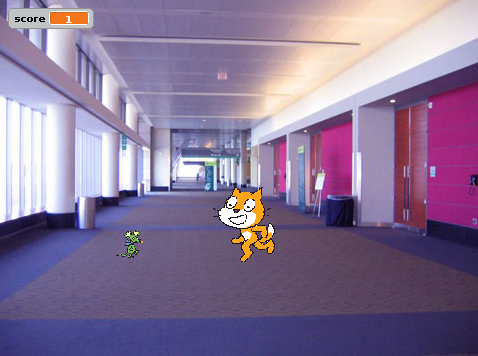

---
title: Felix and Herbert (Scratch 2)
level: Level 1
language: en-GB
stylesheet: scratch
embeds: "*.png"
...

# Introduction { .intro }

We are going to make a game where you control a mouse (Herbert) and a cat (Felix) chases you. If you avoid being caught your score goes up, but get caught and your score goes down. We are going to tell the computer what to do to make the game work.

If your are being tutor led, please wait to be told to move to the next step.



# Step 1: Prepare Felix (the cat) { .activity }

## Activity Checklist { .check }

+ Start a new project.
+ Click on the sprite Sprite1 in the Sprite Summary Area, and then click on the `i` button to the top left of the Sprite1. Change the name of the sprite to **Felix**.
+ Make sure Felix only points left-right by clicking the arrows button as the rotation-style for Felix 
+ Shrink Felix by clicking the `Shrink sprite` button and clicking on Felix until he is the right size.
+ Click and hold on Felix, and drag him to the centre of the stage area.

# Step 2: Prepare the stage { .activity }

## Activity Checklist { .check }

+ Click on **stage backdrop** and switch to the `Backdrops` tab, and then click the `Choose Backdrop from library` button and choose the backdrop indoors/hall.
+ Delete the original blank backdrop by clicking the 'X' button next to it.

# Step 3: Prepare Herbert (the mouse) { .activity }

## Activity Checklist { .check }

+ Get a new sprite using the Giga button in the Sprite Summary Area, and choose the mouse from the Animals library.
+ Click on the `i` button to the top left of the new sprite. Change the name of the sprite to **Herbert**.
+ Make sure Herbert only points left-right by clicking the arrows button as the rotation-style for Herbert.
+ Shrink Herbert by clicking the `Shrink sprite` button and clicking on Herbert until he is the right size.
+ Click and hold on Herbert, and drag him to the side of Felix.

# Step 4: Make Herbert move { .activity }

## Activity Checklist { .check }

+ Create this script on the scripts tab for Herbert:
```blocks
    when FLAG clicked
    forever
        go to [mouse-pointer v]
        point towards [Felix v]
    end
```

## Test your project { .flag }

Set the stage to full screen. Click the green flag.
+ Does Herbert follow the mouse pointer?
+ Does Herbert always point towards Felix?

Extra questions:
+ What happens if you use a different setting as the rotation-style for Herbert?
+ Move the `forever` block away from the `When (green flag) clicked` block. Does Herbert follow the mouse pointer?
+ How easy is it to move Herbert round Felix? What if Felix is bigger? What if Felix is smaller?

## Save your project { .save }

# Step 5: Make Felix move { .activity }

## Activity Checklist { .check }

+ Create this script on the scripts tab for Felix:
```blocks
    when FLAG clicked
    forever
        point towards [mouse-pointer v]
        move (4) steps
    end
```
# Step 6: Make Felix run { .activity }

## Activity Checklist { .check }

+ Get a new costume using the Giga button in the Sprite Summary Area, and choose the other cat from the Animals library.
+ Add a `next costume` block to the script:
```blocks
    when FLAG clicked
    forever
        point towards [mouse-pointer v]
        move (4) steps
        next costume
    end
```
## Test your project { .flag }

Set the stage to full screen. Click the green flag.
+ Does Felix move towards Herbert?
+ If you keep moving Herbert, does Felix keep following?
+ Does it look like Felix is walking / running?

Extra questions:
+ What happens if the `move (4) steps` is changed to `move (8) steps`? What about `move (2) steps`?
+ Can you make Herbert avoid Felix for a long time?

## Save your project { .save }


##############################################

# Step 3: Felix says when he’s caught Herbert { .activity }

We want Felix to know when he’s caught Herbert, and tell us.

## Activity Checklist { .check }

+ Change Felix’s script to be this:
```blocks
    when FLAG clicked
    forever
        point towards [mouse-pointer v]
        move (10) steps
        next costume
        play drum (3 v) for (0.3) beats
        if <touching [herbert v]?>
            say [Caught you!] for (1) secs
        end
    end
```

## Test your project { .flag }

Click the green flag.

+ What does Felix say when he’s caught Herbert?
+ What do you notice about Felix catching Herbert?

## Save your project { .save }

# Step 4: Herbert turns into a ghost when he’s caught { .activity }

Instead of Felix saying something, we want Herbert to turn into a ghost when he’s caught.

## Activity Checklist { .check }

+ Change Felix’s script to send this message when he catches Herbert:
```blocks
    when FLAG clicked
    forever
        point towards [mouse-pointer v]
        move (10) steps
        move (20) steps
        next costume
        play drum [3 v] for (0.3) beats
        if <touching [herbert v]?>
            broadcast [caught v]
            play drum [17 v] for (0.2) beats
            wait (1) secs
        end
    end
```
+ Add a new costume into Herbert by selecting Herbert, going into the Costumes section, and click the `Choose costume from Library button ` { .blocklightgrey }. Select the **fantasy/ghost2-a** costume.
+ Make the ghost costume smaller by clicking on it in the Paint Editor, and dragging the box that appears, to resize it.
+ Change the names of Herbert’s costumes so the mouse costume is called ‘alive’ and the ghost costume is called ‘dead’.
+ Create a new second script for Herbert in the scripts area to turn him into a ghost:
```blocks
    when I receive [caught v]
        switch costume to [dead v]
        wait (1) secs
        switch costume to [alive v]
```

## Test your project { .flag }

Click the green flag.

+ Does Herbert turn into a ghost when he’s caught?
+ Does Felix play the right sounds at the right time?
+ Does Felix still stay still for long enough for Herbert to get away?

## Save your project { .save }

# Step 5:  Keep score { .activity }

Let’s add a score so we know how well we do at keeping Herbert alive.

We’ll start the score at zero and increase it by one every second. If Felix catches Herbert, we’ll reduce the score by one hundred.

## Activity Checklist { .check }

+ Make a variable, for all sprites, called Score. Click on `Data` { .blockorange } in the top menu, make a variable and name it `score` { .blockorange }, ensuring that "For all sprites" is selected Leave the tick in the box so the Score shows up on the Stage, you can move the score box to where you would like on the hall background.
+ On the stage, create these two scripts in the backdrop's script area:
```blocks
    when gf clicked
        set [score v] to [0]
        forever
            change [score v] by (1)
            wait (1) secs
        end

    when I receive [caught v]
        change [score v] by (-100)
```

## Test your project { .flag }

Click the green flag.

+ Does the score go up by one every second?
+ Does the score go down by one hundred when Herbert is caught?
+ What happens when Herbert is caught before score reaches one hundred? Does the score go back to zero when you start a new game?

## Save your project { .save }

Well done, you’ve finished! Now you can enjoy your game!

Don’t forget you can share your game with all your friends and family by clicking on **Share** on the menu bar!
